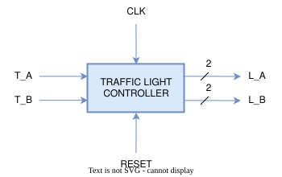

# Traffic Light Controller (FSM)

This project implements the traffic light controller FSM from *Digital Design and Computer Architecture, RISC-V Edition* by Sarah L. Harris and David Harris (Chapter 3, Sequential Logic Design). The FSM specification and state encoding approach follow the textbook's example; the RTL implementation, testbenches, and verification are original work.

---

## Design Concept

Two intersecting streets, each with a traffic sensor and a light:

- **Inputs:** `T_A`, `T_B` — traffic sensors on each street (1 = traffic present)
- **Outputs:** `L_A[1:0]`, `L_B[1:0]` — light state for each street (red / yellow / green)
- **Control:** `CLK`, `Reset`

The controller is a 4-state Moore FSM (see state diagram below) that cycles each street through green → yellow → red while the other street does the opposite, advancing based on the traffic sensors.

---

## Black-box view

---
