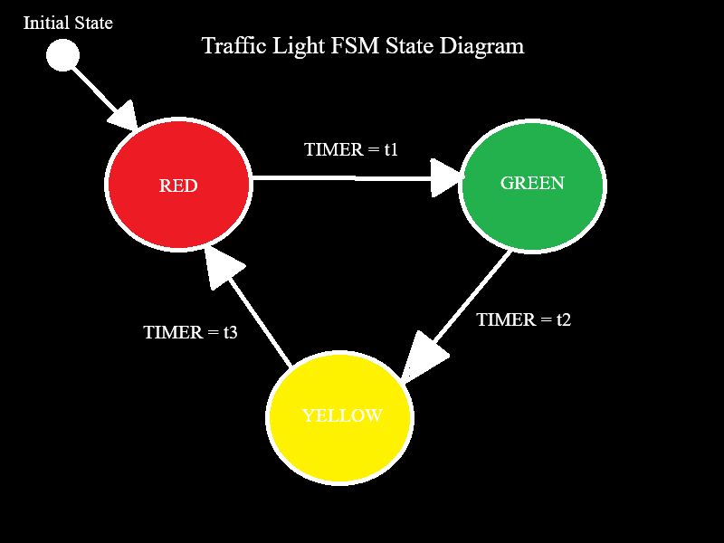

# Traffic Light Controller (FSM)

## Overview
This project implements a traffic light controller using Finite State Machine (FSM) design in Verilog.

---

## Design Concept
We've got 3 states: RED, GREEN, YELLOW where a sequential transition is implemented based on timing.  
The system cycles through three states:  
RED → GREEN → YELLOW → RED

---

## State Diagram

---

## Implementation
Language: Verilog  
Simulation tool: ModelSim / Vivado

---

## Testbench
Simulates timing transitions  
Verifies correct state switching

---

## Results
(Add waveform screenshot here)

---

## What I Learned
FSM design  
Verilog basics  
Debugging waveforms
