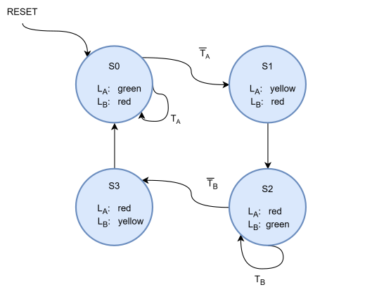

# Traffic Light Controller (FSM)

This project implements the traffic light controller FSM from *Digital Design and Computer Architecture, RISC-V Edition* by Sarah L. Harris and David Harris (Chapter 3, Sequential Logic Design). The FSM specification and state encoding approach follow the textbook's example; the RTL implementation, testbenches, and verification are original work.

---

## Design Concept

Two intersecting streets, each with a traffic sensor and a light:

- **Inputs:** `T_A`, `T_B` — traffic sensors on each street (1 = traffic present)
- **Outputs:** `L_A[1:0]`, `L_B[1:0]` — light state for each street (red / yellow / green)
- **Control:** `CLK`, `Reset`

The controller is a 4-state Moore FSM (see state diagram below) that cycles each street through green → yellow → red while the other street does the opposite, advancing based on the traffic sensors.

---

## Black-box view

---

## State transition diagram

On `Reset`, the FSM enters `S0` (`L_A` green, `L_B` red). Each clock cycle, the FSM either holds its current state or advances, based on the traffic sensors:

- **`S0` → `S0`** while `T_A` is asserted (traffic still present on Academic Ave.)
- **`S0` → `S1`** on `T̄_A` (street clears, `L_A` advances to yellow)
- **`S1` → `S2`** unconditional (yellow always advances after one cycle)
- **`S2` → `S2`** while `T_B` is asserted
- **`S2` → `S3`** on `T̄_B`
- **`S3` → `S0`** unconditional

---

## Architecture

The design is split hierarchically, following the textbook's structure:

- `next_state_logic` — combinational; computes next state from current state + `T_A`/`T_B`
- `state_register` — sequential; holds current state, clocked on `CLK`, synchronous `Reset`
- `output_logic` — combinational; computes `L_A`/`L_B` from current state
- `top_module` — instantiates and wires the above three

---

## Tools

- Icarus Verilog 
- GTKWave 
- Quartus Prime 
