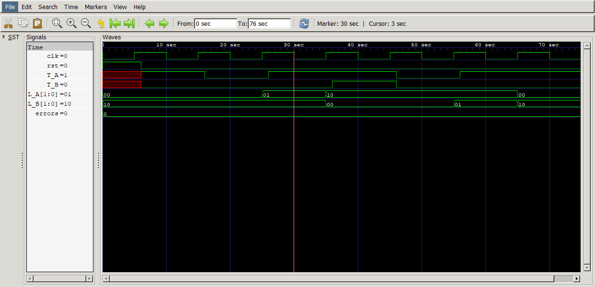
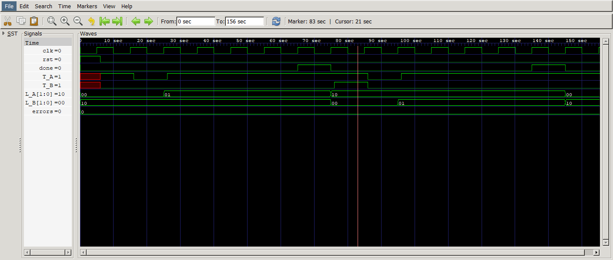

# Simulation Results

## Phase 1 — Base FSM

Yellow states advance unconditionally after one clock cycle.

---

## Phase 2 — Timed Yellow Phase

Yellow states now hold for a fixed duration, gated by a `done` signal from a parameterized `counter` module.

